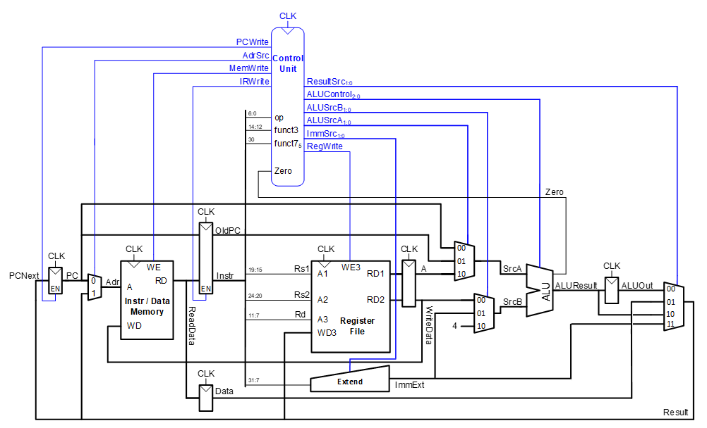
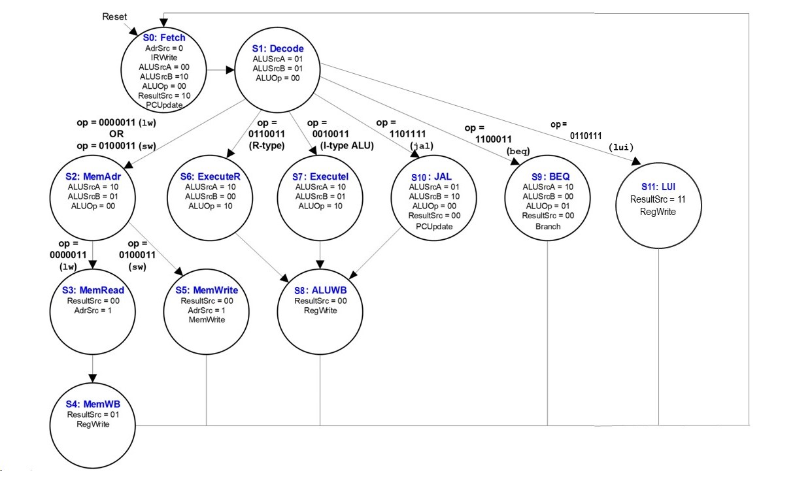

# Multi-Cycle RISC-V Microcontroller

Welcome to the multi-cycle version of our RISC-V microcontroller repository! This section provides detailed information and resources related to the multi-cycle architecture.

## Overview

The multi-cycle architecture is a design approach that breaks down the execution of instructions into multiple clock cycles. Unlike a single-cycle architecture, where each instruction completes in one clock cycle, the multi-cycle design allows for a more flexible and optimized utilization of hardware resources.

## Architecture Overview

In the multi-cycle RISC-V microcontroller, each instruction is divided into several stages, including instruction fetch, instruction decode, execution, memory access, and write-back. This modular approach enables a more efficient use of resources, as different stages can operate concurrently.

The following diagram shows the multi-cycle architecture of the RISC-V microcontroller:

As shown in the diagram, the multi-cycle architecture divides the datapath into different stages, this allows to reduce the critical path of the design and to improve the overall performance of the microcontroller.

## Control Unit Overview

The control unit plays a pivotal role in orchestrating the flow of instructions through the various stages of the multi-cycle architecture. Its primary responsibilities include generating the necessary control signals to regulate the behavior of different components such as the ALU (Arithmetic Logic Unit), memory, and registers.

Oposed to the single-cycle architecture, the control unit in the multi-cycle architecture is more complex, as it needs to generate the control signals for each stage of the datapath. In this case, the control unit is implemented as a finite state machine (FSM) that is able to generate the control signals for each stage of the datapath

The following diagram shows the control unit of the multi-cycle RISC-V microcontroller and its FSM with the different states:

