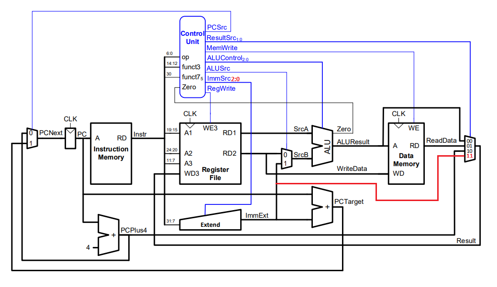
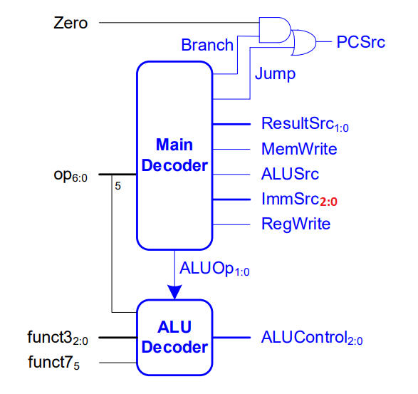

# Single-Cycle RISC-V Microcontroller

Welcome to the single-cycle version of our RISC-V microcontroller repository! This section provides detailed information and resources related to the single-cycle architecture.

## Overview

The single-cycle architecture is a design approach that executes each instruction in one clock cycle. This approach is simple to implement, but it is not very efficient, as it increases the critical path of the design and limits the performance of the microcontroller.

## Architecture Overview

In the single-cycle RISC-V microcontroller, each instruction is executed in one clock cycle. The following diagram shows the single-cycle architecture of the RISC-V microcontroller:

## Control Unit Overview

In the single-cycle RISC-V microcontroller, the control unit is responsible for generating the control signals that are required to execute each instruction. The control unit is simple and is implemented with a truth table that maps the type of instruction to the control signals that are required to execute it.

The following diagram shows the general overview of the control unit of the single-cycle RISC-V microcontroller:

