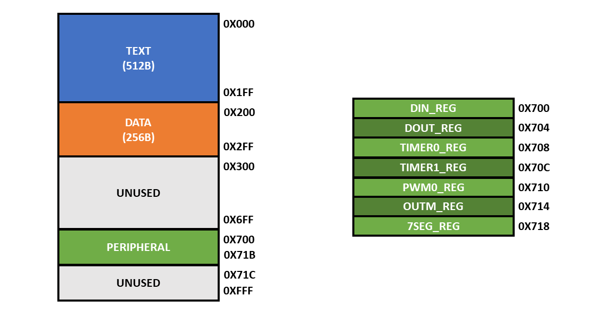

# Memory Architecture

Welcome to the memory architecture section of the single-cycle version of our RISC-V microcontroller repository!

## Overview

The memory architecture in the single-cycle version of our RISC-V microcontroller is build as two memory blocks, one for the text section (instruction memory) and one for the data section. This is not a realistic approach, as it is more common to have a single memory block in a microcontroller. Although this is not a realistic approach, it is easier to implement and understand. After implementing the multi-cycle version of our RISC-V microcontroller, we came back to this version and adapted the memory address to be compatible with the multi-cycle version. This allows us to use the same program in both versions of our RISC-V microcontroller.

## Memory Map

The memory map for the single-cycle version of our RISC-V microcontroller is shown below. Take into account that the instruction memory and the data memory with peripherals are two different memory blocks:

The memory map is divided into 3 sections:

-   **Text**: This section is used to store the instructions of the program. It starts at address `0x000` and ends at address `0x1FF`. The size of this section is 512B.

-   **Data**: This section is used to store the data of the program. It starts at address `0x200` and ends at address `0x2FF`. The size of this section is 256B.

-   **Peripheral**: This section is reserved for the memory mapped registers that control the peripherals. It starts at address `0x700` and ends at address `0x71B`. The size of this section is 28B. The peripherals are described in the [peripherals](peripherals/README.md) section.
